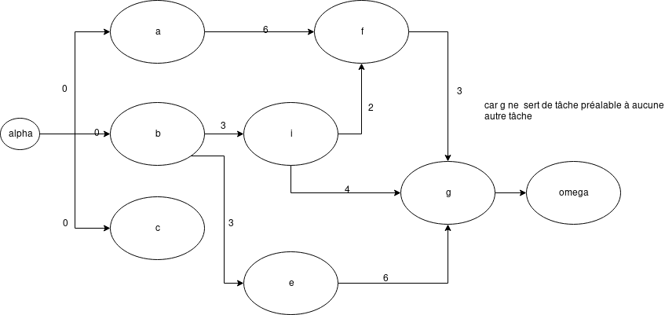
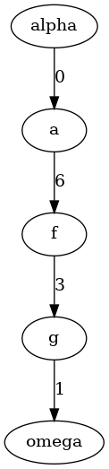

---
author: trinh_v
title: Graphes, Reseaux, Flots
...

# Ordonnance de projets <=> recherche du chemin optimal dans un graphe.

* Projet -> tâches liérs par des contraintes
* On recherche à quelle date démarrer chaque tâche pour que le projet soit terminé au plus t$ot

Problème: Ordonnancement.
Difficulté: Différents types de contraintes liant les tables.

## Cas simple: Les contraintes sont seulement de type potentiel.

Ex: La tâche *j* ne peut démarrer que *x* jours après le démarrage de *i* -> Contraintes
d'antécédence.

Il existe deux méthodes:

* Métothe **potentiel-tâche**
* Méthode **pert**

### Méthode Potentiel-tâche

Exemple: à 7 taches Tableau des contraintes

| tâches | Durées | Contraintes |
| :------------- | :------------- |:--:|
|a   | 6  |   |
|b   | 3  |   |
|c   | 6  |   |
|d   | 2  | b achevé  |
|d   | 4  | b achevé  |
|f   | 3  | d et a achevées  |
|g   | 1  | f, e, c achevées  |

On peut associer un graphe
* sommets <=> tâches
  - 1 sommet début $\alpha$
  - 1 sommet fin $\omega$

avec *i* -x-> *j*

*j* ne peut démarrer que *x* jours après le démarrage de *i*

Réaliser le projet au plus tôt: Recherche du chemin maximal entre $\alpha$ et
$\omega$.

#### Algo de Bellman.

Ordonance au plus tôt: On cherche la date de début au plus tôt $t_i$ et de la tâche *i*
$\forall i$

|Tâches|$\alpha$| a | b | c | d | e | f | g | $\omega$ |
|:----:|:------:|:-:|:-:|:-:|:-:|:-:|:-:|:-:|:------:|
|Prédécesseurs immédiats|   | $\alpha$ 0  | $\alpha$ 0  | $\alpha$ 0  | b3  | b3  | b2  | f3  | g1  |
|   |   |   |   |   |   |   |  a6 | e4  |   |
|   |   |   |   |   |   |   |   | c6  |   |

Algorithme de Bellman:

* Initialisation: Date de début au plus tôt de $\alpha$ : 0
* Mouvement haut / bas
  - On répercute dans la deuxième ligne les dates de début au plus tôt dès qu'on les connaît.
* Mouvement de bas / haut
  - Lorsqu'une colonne est complète (on connaît les dates de début au plus tôt de tous les prédécesseurs), on peut calculer la date de début au plus tôt de la tâche qui est en tête de colonne dans la première ligne.

=> Diagrame de Gantt calé à gauche

-> Durée minimale du projet: 10 jours.

**Tâches critiques** -> les tâches qui n'acceptent aucun retard: tout retard sur le démarrage d'une tâche donne un retard du projet.

Tâches critiques: Celles qui sont sur le chemin le plus long de $\alpha$ à $\omega$ [Longueur 10]

Ordonnancement au plus tard: Hypothèses -> La durée minimale du projet est respéctée

|Tâches|$\alpha$| a | b | c | d | e | f | g | $\omega$ |
|:----:|:------:|:-:|:-:|:-:|:-:|:-:|:-:|:-:|:------:|
| Successeurs Immediats   | a0 | f6  |  d3 | g6  | f2  |  g4 | g3  | $\omega$ 1 |   |
|   | b0  |   | e3  |   |   |   |   |   |   |
|   |  c0 |   |   |   |   |   |   |   |   |

* Initialisation: Date de début au plus tard de $\omega$ = durée minimale du projet = 10
* Mouvement haut/bas
* Mouvement bas/haut

**Marge totale** de la tâche *i* non critique

* $t_i*$ = tête de début au plus tard de i
* $t_i$ = tâte de début au plus tôt de i

Marge totale:
$$M_i = t_i* - t_i$$

$$M_a = M_f = M_g = 0$$

tâches critiques -> marge totale = 0

$$M_b = 1 = 1-0$$
$$M_c = 3 = 3-0$$
$$M_d = 1 = 4 - 3$$
$$M_e = 2 = 5 - 3$$

**Marge libre** $m_i$ = durée dont on peut retarder *i* sans conséquence (retard) sur aucune autre tâche

$$m_i = Min(t_j - t_i - v_{ij}) j \in \Gamma(i)$$

* $t_i$, $t_j$ = dates de début au plus tôt de i, j
* $v_{i,j}$ = valuation de l'atrc i,j
* $\Gamma(i)$ = liste des successeurs immédiats de *i*

$$m_b = min(t_d - t_b - t_{bd}, t_e - t_f - v_{fe})$$
$$ = min(3 - 0 - 3, 3 - 0 - 3)$$
$$ = 0$$

$$m_c = t_g - t_c - v_{cg} = 9 - 0 - 6 = 3 = M_c$$
$$m_d = t_f - t_d - v_{df} = 6 - 3 - 2 = 1 = M_d$$
$$m_e = t_g - t_e - v_{eg} = 9 - 3 - 4 = 2 = M_e$$

Algorritthme de Ford: Recherche du chemin optimal entre 1 sommet particulier (la racine) et tous les autres sommets
(méthode matricielle -> Chemin optimal entre 2 sommets quelconques)

Recherche du chemin minimal:

* On numérote dles sommets du graphe:
  - Racine no. 1
  - autres sommets (si possible numérotation topoligique)

i -> j, no. de i < no. de j.

$\lambda_i$ = longueur du chemin minimal allant du sommet 1 au sommet i.

**Algorithme de Ford**

* Initialisation $\Lambda_1$ = 0
  - $\lambda_i = +\infty, \forall i != 1$

$\lambda_i$ va évoluer jusqu'au dernier $\lambda$.

* On "examine" les arcs du graphe à tour de rôle, dans l'ordre suivant:
  - On considère tous les arcs issus du sommet 1; on les considère dans l'ordre croissant de leur extrémité terminale j
  - On considère tous les arcs issus du sommet 2; dans l'ordre croissant de leur extrémité terminale j

Examen de l'arc (i,j)

Si v(i,j) = valeur de l'arc (i,j) < $\lambda_{j} - \lambda_{i}$ alors on change $\lambda_{j}$, on le remplace par $\lambda_i$ + v(i,j)

**Remarque** Examiner un arc(i,j) de numérotation non topologique -> (numéro de i) > (no. de j)

Risque du problème: Si l'examin entraîne un changement de la valeur $\lambda_j$, alors il faut revenir en arrière en repartant du sommet i = j.

**Identification de chaque optimal du sommet 1 au sommet i**

i'' -> i' -> i

Predecesseur de i -> i'
$\lambda_i$ - $lambda_{i'}$ = v(i',i)

**exemple:** page 106 du poly

Cervières -> no.1

``Sorry not sorry j'ai rajkit l'exemple``
