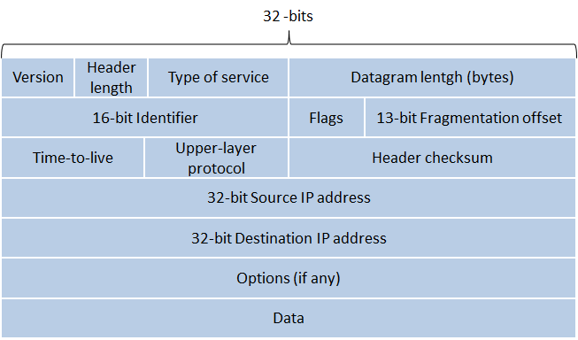

# Architecture TCP IP

## Historique: cf poly

1er réseau: Réseau ARPANET RIP petit ange)  
Utilisé par les académique.
Devenu MILNET par des problèmes de sécurité

## A qui appartient l'Internet?

ICANN, IETF, RFC

## IPV4

Quand des paquets sont envoyés par IP, il se peut qu'ils arrivent dans le désordre, TCP s'occupe de les mettre dans l'ordre.

Un protocole vérifie les erreurs?
* Vérifier le champs de contrôle:
  - Si oui, il verifie. Il est fiable?
    - Si il vérifie les data, oui.
    - Si non, il vérifie que l'entête
  - il n'y a pas de champs de contrôle.

Tous les fragments d'un paquet doit avoir le même ID  

**Durée de vie** Nombre de passerelle que le paquet est autorisé à traverser pour eviter de congestioner le reseau avec des paquets perdus
