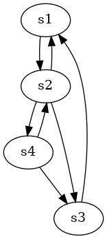
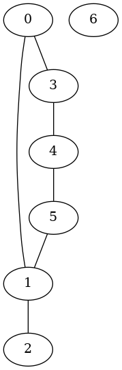

# Théorie des Graphes

## Introduction


* 1735 Euler
* 7 ponts de Koringsberg -> Est-il possible de faire une promenade pour traverser chaque ponts une seule fois? Non c'est pas possible.


Deg(s2)=5
Deg(s1)=3
Deg(s4)=3
Deg(s3)=3

Un **multigraphe** peut avoir plusieurs fois une arrête reliant deux sommets

A chaque fois qu'on passe par un sommet, on utilise une arete pour entrer et une pour sortir sauf pour les sommets initiaux et finaux.
**=>** Si un chemin eulérien existe, il faut nécessairement qye ke nombre de sommets de degré impaire
* soit 0 (si arrivée = départ)
* soit 2 (si l'arrivée != départ)

**=>** il n'existe pas de solution aux 7 ponts de K.

### Théorèmes
* Un multigraphe non orienté possède un cycle eulérien si et seulement si tous ses sommets sont de degré pair et les sommets de degré > 0 sont dans la même **composante connexe**
* S'il y a deux sommets de degré impair, alors il existe un chemin eulérien

### Algorithme pour produire un cycle eulérien dans un graphe connexe dont tous les sommets sont pairs


Graphe K5

1. Choisir un sommet (départ) construire un chemin a partir de ce sommet en effacant les arêtes au fur et a mesure. Comme les sommets sont de degré pair, on peut toujours avancer jusqu'à retomber sur le sommet de départ où on s'arrête.
  * a -> b -> d -> e
2. Dans les arêtes qui restent, l'un des sommet est forcément sur le chemin créé car le graphe est connexe
3.  Etape 1 a partir de ce sommet
  * b->c->e->d
4. Insérer le cycle dans le chemin
  * a->**b->c->e->b**->d->e->a
5. Répéter 2-3-4 jusqu'à ce qu'il n'y ai plus d'arrête.
  * a->c->d->a
  * a->c->d->a->b->c->e->b->d->e->a

## 1847 : Kirchhoff

Arbre recouvrant : un arbre qui recouvre le graphe  

## 1860 : Cayley

Énumérer des isomères d'alcanes
```
n=1 1 isomère
n=2 1 isomère
n=3 1 isomère
n=4 2 isomères
n=5 3 isomères
n=6 5 isomères
n=7 9 isomères
n=8 18 isomères
    35
    75
    155
    355
```

Un alcane = 1 arbre avec n carbones et x hydrogènes
on veut montrer que x = 2n+2

n+x sommets
n+1-1 arêtes <- Propriété: Un arbre de n sommets possède n-1 arêtes  

### Propriété
La somme des degrés de tous les sommets = 2 * le nombre d'arêtes.

Somme(v dans V, [deg(v)]) = 2 * |E|
Somme(v dans V, [deg(v)]) = 2 * (n + x - 1)
4n+x = 2n + 2x -2
**2n+2 = x**

**propr** Le nombre de sommets de degré impair est pair
**preuve** Somme(v dans V, [deg(v)]) = 2* |E| est pair

### La formule de Cayley

Le nombre d'arbre (*graphe acyclique et connexe*) (sans racine) de sommets numérotés est n^(n-2)

#### Demonstration (cf: Wikipedia)

### Théorème
Le nombre d'arbres couvrants d'un graphe G est égal à la valeur absolue de n'importe quel cofacteur de la matrice laplacienne de G

La matrice laplacienne
`` L = D - M ``
D= Matrice des degrés
M= Matrice d'adjacence

Pour K4
D =

|2|0|0|0|
|-|-|-|-|
|0|3|0|0|
|0|0|3|0|
|0|0|0|2|
M =

| | | | |
|-|-|-|-|
|  0 |  1 |  1 | 0  |
| 1  |  0 | 1  | 1  |
| 1  | 1  | 0  |  1 |
| 0  |  1 | 1  | 0  |

L=

| 2  | -1  |-1   | 0  |
|----|-----|-----|----|
| -1 |  3  |  -1 | -1 |
| -1 | -1  |  3 | -1  |
|  0 |  -1 | -1  |  2 |


---
15 Février 2018
---


G = (v,E)
V = {0,1,2,3,4,5,6}
E = {{0,1}, {0,3}, {1,2}, {1,5}, {3,4}, {4,5}}
avec la convention que si (s,d) dans E, alors (s,d) = (d, s)
(par exemple on considere aue (4,3) dans E)

On va calculer les compléxités en fonction de |V| et de |E|
|E| <= [2 parmi |V|] = (|V| * (|V| - 1)) / 2 < |V|² / 2
``|E| = O(|V|²)``

Dans un grphe connexe, (chaque sommet a chemin vers n'importe quel autre) il y a au moins |E| >= |V| - 1
`` |E| = OMEGA(|V|) si graphe connexe``

### DFS (Depth First Search)

Liste d'adjacence
0| ->1->3
1| ->0->2->5
2| ->1
3| ->1
4| ->0->4
5| ->1->4
6|  

En python
```python
edges = [[1,3],[0,2,5],[1],[0,4],[3,5],[1,4],[]]
len(edges) = |V|

def dfs(adj):
  n = len(adj)
  seen [False]*n
  def rec(start):
    print(start)
    seen(start)=True
    for d in adj[start]:
      if not seen[d]:
        rec(d)
  for d in range (n):
    if not seen[d]:
      rec(d)
#------------------------------------------------------------------------------
>>> dfs(edges)
> 0
> 1
> 2
> 5
> 4
> 3
```

Version itérative du DFS
Pile de paires (i,j) où i est le sommet edges[i]
j le successeur edges[i][j]
```python
def dfs_iter(adj):
  n = len(adj)
  seen = [false] * n
  stack = []
  for start in range(n):
    if seen[start]:
      continue
    stack = [(start,0)]
    while(stack):
      src, pos = stack.pop()
      if pos == 0:
        print(src)
        seen[src] = True
      if pos == len(adj[src]):
        continue
      stack.append(src, pos+1)
      if not seen(adj[src][pos]):
        stack.append((adj[src][pos],0))
```

### BFS -BReadth First Search-

```python
def bfs(adj):
  n = len(adj)
  seen = [False] * n
  for start in range(n):
    if seen[start]:
      continue
    queue = [start]
    seen[start] = True
    while queue:
      src = queue.pop(0)
      print(src)
      for dst in adj[src]:
        if not seen[dst] :
          seen[dst] = construirequeue.append(dst)
```

### Calcul de distance depuis un sommet

```python
from collections import deque

def distmap(adj, start):
  n = len(adj)
  dist = [None] * n
  queue = deque([start])
  while queue:
    src = queue.popleft()
    d = dist[src]
    for dst in adj[src]:
      if dist[dst] is None:
        dist[dst] = d+1
        queue.append(dst)
  return dist
```

Que faut-il changer pour travailler un graphe orienté?
Rien dans l'algo. C'est just 'adj' qui change (et n'est plus symétrique
Que  faut-il changer si le graphe est pondéré par des distances?

### Dijkstra

cf Wikipedia

***
# 22 fevrier 2018
***

Algo Bellman-Ford : PCC des graphes avec poids dans R sans cycle. (1 source, n destinations)

3 algos: PCC avec poids dans R, n sources, n destinations.  


***
# 08 mars 2018
---

## Couplage (matching)

### Problème 2 : Armée multinationale

* chaque soldat parle >= 1 langue
* Il faut 2 soldats parlant la même langue

Maximiser le nombre de tanks (2 soldats qui parlent la même langue)
(schema : K5, K3, K4; K4 et K3 relié aux bords de K5)

### Problème 3 : greffe d'organes

* Receveur A | C
* Donneur  B | D

A non compatible avec B
C non compatible avec D

Maximiser le nombre de greffes


**Def** :

* Un couplage d'un graphe G = (V, E) est un sous ensemble M $\subset_=$ E d'arêtes tel aue M ne contient pas deux arêtes voisines
* Un couplage maximal est un couplage M qui n'est pas contenu dans un couplage strictement plus grand
* Un couplage maximum est un couplage M tel que pour tout couplage M'; |M'| <= |M|
```
E = ${e_1, e_2, e_3, e_4, e_5, e_6}$
M1 = $\emptyset$ est un couplage "trivial"
M2 = {e_1, e_4} est un couplage maximal non maximum
M3 = {e_1, e_3} n'est pas maximal car contenus dans {e_1, e_3, e_5}
M4 = {e_1, e_3_ e_5} est maximal et maxumum
M5 = {e_2, e_4, e_6} aussi
```

**Note**: Un couplage maximum est maximal

* Dans un graphe de |v| sommets, tout couplage M vérifie |M| >= $\lfloor M/2 \rfloor$

### Construction d'un couplage maximal?

Répéter:

* Tirer une arête (x, g) au hasard
* Ajouter (x, g) à F
* Supprimer (x, g) et les arêtes incidentes

### Construire un couplage maximum ?

* On construit un chemin améliorant
* On permute les couleurs le long de ce chemin
* Ca fait gagner une arête dans le couplage

Répéter jusqu'à ce que le chemin

**def** :

* Sommet libre: Sommet dont toutes les arêtes incidentes ne sont pas dans M
* Un chemin P $\in$ E est améliorant si il relie 2 sommets libres en alternant des arêtes de E \ M et des qrêtes de M

**Prop** :

* Si G = (v, E) a un couplage M et un chemin améliorant P alors le couplage
  - M' = M $\oplus$ P a une arête de plus que M.

**Théorème**:

* Il existe un chemin améliorant **ssi** M n'est pas maximum
  - Démo: ($\rightarrow$) évident
  - ($\leftarrow$) On suppose M est non maxumum, donc il existe M' tq |M'| > |M|. Considérons le graphe G = (V, M' $\oplus$ M)
    a. G' contient plus d'arêtes de M' que de M
    b. Chaque sommet de G' touche au plus une arête de M et au plus une arête de M'
  - Les sommets non isolés sont connectés par alternance d'arêtes de M et M' à cause de a. et une composante de G' contient plus d'arêtes de M' et forme un chemin ameliorant.

```
M $\rightarrow \emptyset$
  Tant qu'il existe un chemin améliorant P
    M $\rightarrow$ M $\oplus$ P
return M
```

### Algo d'edmonds pour trouver un chemin améliorant.

* 
